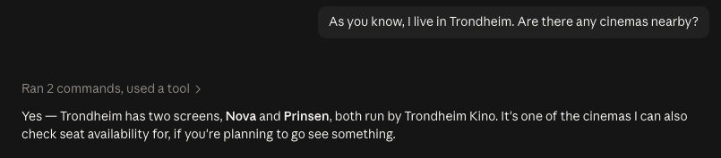
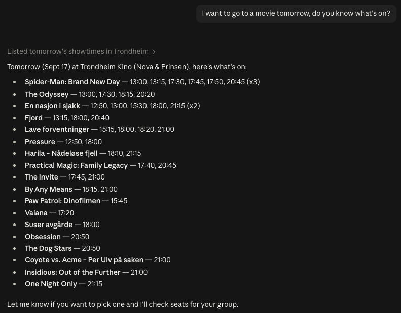
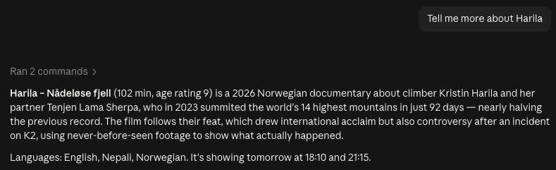
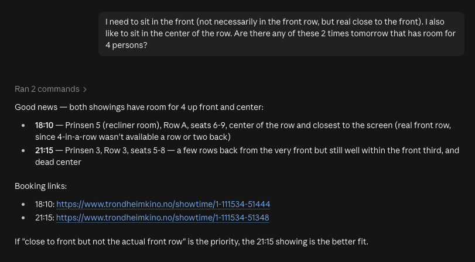
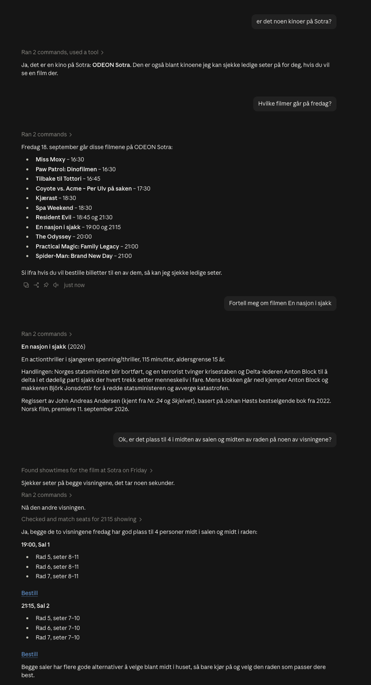

# cinema-seat-finder


A Claude Code skill that lists today's showtimes at *any* Norwegian cinema
— nationwide, or narrowed to a town you name — and, for a given film, finds
which showtimes at Trondheim Kino, Steinkjer kino, Kimen kino (Stjørdal),
Haugesund kino, Caroline kino (Kristiansund), Aurora Kino (Tromsø, Narvik,
Alta, Kirkenes, Lakselv), ODEON Kino (any city), any ebillett.no venue
(~65 mostly small independent theaters nationwide), or any NFkino venue
actually have room for a group together in their preferred part of the
room — instead of manually clicking through film → time → seat count →
seatmap for every candidate showing.

Ask something like:

> 3 of us want to see Spider-Man tonight, ideally seated in the back

and get back a ranked list of showtimes that genuinely have N contiguous
available seats in that zone, with booking links to finish checkout
yourself. The skill never completes a purchase.

Or, if you don't know what's on yet:

> what's playing tonight?
> what's on in Bergen this weekend?

and get back the lineup with showtimes — nationwide, or just that town —
no seat-checking involved. You can also ask about towns/cinemas themselves:

> is there a cinema in Ålesund?

or about a film itself, no showtimes involved:

> what's Fjord about?
> how long is Fjord, and what's the age rating?

Listing, location lookups, and movie info cover every Norwegian cinema (and
every film) Filmweb knows about; seat-finding only works for the four
platforms behind the chains named above (ten Filmgrail cinemas, any ODEON
city, any ebillett.no venue, or any NFkino venue) — see Scope below for
why, and the skill says so plainly if a film you ask about is only playing
somewhere seat-checking isn't supported.

## See it in action

A real conversation, start to finish — location lookup, listing, movie
info, then seat-finding:

<table>
<tr>
<td width="50%">

**"Are there any cinemas nearby?"**



</td>
<td width="50%">

**"What's on tomorrow?"**



</td>
</tr>
<tr>
<td width="50%">

**"Tell me more about Harila"**



</td>
<td width="50%">

**"Room for 4, front and center?"**



</td>
</tr>
</table>

All of Filmweb's data is in Norwegian, so the skill works natively in
Norwegian too — a full session, unprompted, in one screenshot:

<details>
<summary>Full conversation in Norwegian (click to expand)</summary>



</details>

## How to use this skill

Open Claude Code with this repo as (or inside) the working directory, so it
can discover `.claude/skills/cinema-seat-finder/SKILL.md`. Then either:

- Just ask in natural language — Claude will invoke the skill automatically
  when your request matches, e.g. *"3 of us want to see Spider-Man tonight,
  ideally seated in the back"*.
- Invoke it explicitly with `/cinema-seat-finder <your request>`.

This skill handles four kinds of requests:

**"What's on" — just want to see the lineup, no film picked yet:**

Ask something like *"what's playing tonight"* or *"what movies are on today
in Bergen"*. Claude lists every film showing today with its showtimes and a
booking link, across every cinema Filmweb knows about — nationwide by
default, or just the town you named — including cinemas seat-checking
doesn't cover (Bygdekinoen, ODEON's non-seat-checkable siblings, and so
on): you still get the link to check/book those yourself. No
seat-checking is done for this.

**Location lookups — asking about towns/cinemas, not showtimes:**

Ask something like *"is there a cinema in Ålesund"* or *"what towns do you
cover"*. Claude resolves the town (handles typos/partial names against
Filmweb's own location index) and lists the actual cinema buildings there,
or explains the seat-finding-supported list if you're asking in general.

**Movie info — asking about a film itself, not showtimes or seats:**

Ask something like *"what's Fjord about"* or *"how long is Fjord"*. Claude
resolves the title (disambiguating if there are several plausible matches)
and answers from Filmweb's own data — synopsis, genre, runtime, age
rating, premiere date, Filmweb's own user rating. All of Filmweb's text is
Norwegian; Claude translates unless you're asking in Norwegian yourself.
No showtimes or seat-checking here — that's a separate request.

**Seat-finding — you know the film and need seats together:**

Include in your request:
- **Film title** — approximate is fine (e.g. "Spider-Man"); Claude will
  confirm the closest match if it's ambiguous.
- **Party size** — how many seats you need together.
- **Zone preference** (optional) — any of `front`/`middle`/`back` and
  `left`/`center`/`right`. Omit either or both for "anywhere".
- **Date** (optional) — defaults to today.
- **Town** (optional) — narrows the search; without one, Claude checks
  nationwide but only ever seat-checks the supported cinemas (the ten
  Filmgrail ones, any ODEON city, any ebillett.no venue, or any NFkino
  venue).

Claude will check every showtime for that film today (not just the first
one that works) and report back a ranked list of the ones with room for
your group, each with the actual seat labels and a booking link — you
complete the purchase yourself. If nothing matches your zone preference,
it'll tell you what else is playing today so you can decide whether to
relax it. If the film is also playing at cinemas outside the supported
ones, those get listed too with a booking link to check manually — as the
whole answer if that's the only place it's playing, or as a secondary note
alongside real matches otherwise.

## Using this in other agentic environments

The skill itself is just a markdown playbook
(`.claude/skills/cinema-seat-finder/SKILL.md`) that orchestrates plain
Python scripts — nothing about it is Claude-specific. Any coding agent that
can read a file and run shell commands can follow the same steps.

**GitHub Copilot** (Copilot Chat in VS Code, or the Copilot coding agent)

- Attach the playbook as context and ask your question, e.g. in VS Code
  Copilot Chat: `#file:.claude/skills/cinema-seat-finder/SKILL.md what's
  playing tonight?`
- To have it apply automatically to every chat in this repo, fold the
  SKILL.md steps into `.github/copilot-instructions.md`, which Copilot
  reads as repo-wide custom instructions.

**Gemini (Gemini CLI)**

- Gemini CLI auto-loads a `GEMINI.md` context file from the repo root, the
  same way Claude Code loads `CLAUDE.md`. Add a `GEMINI.md` at the project
  root that points at the playbook (e.g. `See
  .claude/skills/cinema-seat-finder/SKILL.md for the cinema-seat-finder
  workflow`), or copy its content in directly.
- For one-off use, you can also just paste the SKILL.md content into the
  prompt.

**Any other agent**

- Point it at `.claude/skills/cinema-seat-finder/SKILL.md` as its
  instructions and let it drive `scripts/discover_shows.py`,
  `scripts/filmgrail_checkout.py` + `scripts/filmgrail_zone_match.py`,
  `scripts/odeon_checkout.py` + `scripts/odeon_zone_match.py`,
  `scripts/ebillett_checkout.py` + `scripts/ebillett_zone_match.py`, and
  `scripts/nfkino_checkout.py` + `scripts/nfkino_zone_match.py` per the
  steps there — the scripts are plain Python 3 with no Claude Code
  dependency.

## Scope

**Listing and location lookups are nationwide** — `discover_shows.py`
queries Filmweb directly, which aggregates every Norwegian cinema
regardless of checkout vendor, so these aren't limited to any particular
chain.

**Seat-finding is limited to four checkout platforms.** Filmgrail/Mars
covers ten cinemas, all confirmed live end-to-end (real transaction, real
seatmap, real zone match, clean cancel) to share the exact same checkout
API *and* seatmap shape: Trondheim Kino, Steinkjer kino, Kimen kino
(Stjørdal), Haugesund kino, Caroline kino (Kristiansund), and Aurora Kino's
Tromsø/Narvik/Alta/Kirkenes/Lakselv locations. ODEON's Cinema API backend
covers any ODEON city, the ebillett.no/DX platform covers any ebillett.no
venue, and NFkino's Drupal+Vista platform covers any NFkino venue (see
below for all three). Today's date only, unless another date is given
explicitly.

`scripts/filmgrail_checkout.py` itself is not tied to any one cinema — it
derives the checkout API host and standard ticket category from whichever
showtime URL it's given (see that script's module docstring). A nationwide
survey (`discover_shows.py --location ""` returns every Norwegian showtime
in one call — 893 shows across 110 cinemas on the day this was run) turned
up one cinema on the exact same checkout platform whose seatmap shape
looked different at first: Bergen kino reports pixel coordinates instead
of the `row`/`column` grid the other cinemas use. Its `rowSymbol`/
`columnSymbol` fields turned out to already carry the same clean adjacency
structure though, so `filmgrail_checkout.py` derives a synthetic
`row`/`column` from those instead of the raw coordinates — Bergen kino is
fully supported now too. See
`.claude/skills/cinema-seat-finder/SKILL.md`'s "Filmgrail/Mars cinemas"
section for the full picture, including Bygdekinoen, confirmed to be on a
*different* checkout platform entirely and out of scope for a stronger
reason than that (its screenings have unnumbered, unreserved seating, so
there's no seatmap to check at all). NFKino and ebillett.no were also
found on different vendors during this survey, but unlike Bygdekinoen,
both turned out to be their own separately supported platforms — covered
below.

**ODEON** turned out to be its own case, covered by `scripts/odeon_checkout.py`
and `scripts/odeon_zone_match.py`: ODEON's own site (`www.odeonkino.no`) is
behind an active Cloudflare bot-challenge on every page and is never
touched by this repo, but its booking pages call a separate, genuinely open
backend — `services.cinema-api.com` — confirmed live end-to-end, for two
different ODEON cities, with zero transaction/hold needed at all, unlike
Filmgrail's flow. ODEON candidates are identified by `ticketSaleUrl`
domain (`www.odeonkino.no`), not `firmName` — the chain spans many
different `firmName` strings for the same backend (e.g. "ODEON Oslo",
"Stavanger Kino"). See `.claude/skills/cinema-seat-finder/SKILL.md`'s
"ODEON (Cinema API)" section for the full trail.

**ebillett.no (eBillett/DX)** covers any of the ~65, mostly small
independent theaters on that platform, via `scripts/ebillett_checkout.py`
and `scripts/ebillett_zone_match.py`. Unlike ODEON, it has no bot
protection at all — the whole flow was reverse-engineered from a real
browser session: GET the Filmweb `ticketSaleUrl` to establish a
`PHPSESSID` cookie, GET the `/purchase/setup` page to scrape hidden form
fields and the first ticket category id, then POST back to that same URL
with `categories[0]`/`antall[0]`/`events[0]` (parallel indexed arrays — the
one payload shape that actually works; see the module docstring for the
many shapes that don't). A successful POST returns `302` with a
`Location` header of the form
`/<p_id>/events/<arrnr>/purchase/<token>/<reservationId>/seating` — the
`token` segment *is* the `PHPSESSID` cookie value, and `reservationId` is
server-assigned; both feed a GET to
`.../<token>/<reservationId>/seatmap?a=select&e=<reservationId>&c=0`, whose
compact `seatplan` encoding `seats_from_seatmap()` decodes. Candidates are
identified by `ticketSaleUrl` domain (`checkout.ebillett.no`), the same
domain-based reasoning as ODEON. One honest limitation, unlike Filmgrail:
the best-effort `action=cancel` POST this script sends does **not**
reliably release the held seats immediately (confirmed by re-fetching the
seatmap right after cancelling) — the real release mechanism is
ebillett.no's own ~1-minute inactivity auto-expiry, so
`ebillett_checkout.py` reports `cancelStatus: "attempted"`, never
`"cancelled"`, to avoid overclaiming. Confirmed live end-to-end for two
different venues (Rana kino and Stryn kino). See
`.claude/skills/cinema-seat-finder/SKILL.md`'s "ebillett.no (eBillett/DX)"
section for the full trail.

**NFkino (Drupal + Vista)** covers NFkino's independent cinemas (Arendal,
Farsund, Drammen, Kristiansand, Asker, Askim, Halden, Horten, Hønefoss,
Tønsberg, Oslo, Sarpsborg, Verdal, Bergen/Lagunen, and more), via
`scripts/nfkino_checkout.py` and `scripts/nfkino_zone_match.py`. Like
ebillett.no, it has no bot protection at all. Opening a `ticketSaleUrl`
sets a session cookie and redirects to an order page with its `orderUuid`
embedded in the page's own `drupalSettings` JSON; POSTing
`{"types": [{"id": <ticketTypeUuid>, "quantity": N}]}` to that order's
`add_tickets` endpoint is what actually reserves seats, returning a
structured JSON seatmap (not HTML) with every seat's position plus which
seats are occupied room-wide and which were just assigned to this order.
One correctness wrinkle worth calling out: the "occupied room-wide" list
includes the caller's own just-reserved seats, not just other people's —
`nfkino_checkout.py` corrects for that the same way `ebillett_checkout.py`
does for its state-"2" seats. Cleanup is honest here too: the site's own
`abandon` endpoint reliably returns success, but live testing couldn't
fully confirm every held seat shows as free again afterward, so the real
safety net is NFkino's own ~10-minute order countdown, and `cancelStatus`
says `"attempted"`, never `"cancelled"`. Confirmed live end-to-end for
Horten kino; the same domain-based reasoning is expected to extend to
NFkino's other venues since they share the identical platform, but only
Horten has actually been verified so far. See
`.claude/skills/cinema-seat-finder/SKILL.md`'s "NFkino (Drupal + Vista)"
section for the full trail.

## Public APIs only

Every script here only ever talks to endpoints that answer a plain,
unauthenticated HTTP request the same way they would for anyone opening
that URL in a browser — no login, no session, no defeating a security
control. Concretely:

- **`www.odeonkino.no` is never contacted.** It returns an active
  Cloudflare bot-challenge (`cf-mitigated: challenge`) to every plain
  request, on every page, not just checkout — a clear "no scripted access"
  signal this project respects. `odeon_checkout.py` gets everything it
  needs from `services.cinema-api.com` instead, a separate backend that
  genuinely has no such protection.
- **`checkout.ebillett.no` and `nfkino.no` have no bot protection to
  respect or bypass, either.** Confirmed by extensive live testing during
  development — every endpoint `ebillett_checkout.py` and
  `nfkino_checkout.py` use answers a plain unauthenticated request the
  same way it would a browser; the only real obstacle for either was
  learning the correct payload shape, not any defensive control.
- **A non-default User-Agent header is not evasion.** `filmgrail_checkout.py`
  and `odeon_checkout.py` send `User-Agent: Mozilla/5.0` because some of
  these APIs reject the bare default string a scripting library sends
  (`Python-urllib/3.x`) — the same treatment they'd give any unrecognized
  client, confirmed live by comparing identical requests with and without
  it. That's ordinary HTTP courtesy, not spoofing a browser to get past
  something designed to keep scripts out.
- **Every checkout script cleans up after itself, to varying degrees of
  certainty.** `filmgrail_checkout.py` always cancels the transaction it
  opens, and that cancel is confirmed effective (see its docstring).
  `odeon_checkout.py` never opens one in the first place — its seat data is
  a read-only GET, no side effect at all. `ebillett_checkout.py` and
  `nfkino_checkout.py` each send the same best-effort cleanup request the
  real site itself sends (`action=cancel` and `/abandon` respectively),
  but — unlike Filmgrail — neither is confirmed to actually release the
  held seats; the real safety net in both cases is the platform's own
  short-lived auto-expiry (~1 minute for ebillett.no, ~10 minutes for
  NFkino), and both scripts' `cancelStatus` field says `"attempted"`, not
  `"cancelled"`, to keep that distinction honest.

If a future chain's data isn't reachable this way — genuine auth required,
or an active challenge on the data itself rather than just the storefront
— it doesn't get a script here.

## How it works

1. **Discovery** — `scripts/discover_shows.py` queries Filmweb's public
   GraphQL API for today's showtimes matching the requested film (or every
   film, for a listing request), nationwide or in a named town. The same
   script also resolves/searches town names (`--search-location`) and lists
   cinema buildings in a town (`--list-cinemas`), and resolves/fetches movie
   info — synopsis, genre, runtime, age rating, premiere date, user rating
   (`--search-movie` then `--movie-id`) — all against the same live API.
2. **Seat-check** — for a Filmgrail candidate, `scripts/filmgrail_checkout.py`
   drives the Filmgrail/Mars checkout flow directly over HTTP (select N
   tickets → open a transaction → read the seatmap → cancel the
   transaction), with no browser involved. For an ODEON candidate,
   `scripts/odeon_checkout.py` reads the seatmap straight from ODEON's
   Cinema API backend instead — no transaction or hold, purely read-only.
   For an ebillett.no candidate, `scripts/ebillett_checkout.py` drives that
   platform's own setup → POST → `302` redirect → seatmap flow, opening a
   real reservation and sending a best-effort (not confirmed-effective)
   cancel. For an NFkino candidate, `scripts/nfkino_checkout.py` drives
   that platform's order-creation → add_tickets → structured-seatmap flow,
   with the same kind of best-effort cleanup — see Scope above for both.
   `SKILL.md` classifies each candidate (`firmName` for Filmgrail,
   `ticketSaleUrl` domain for ODEON, ebillett.no, and NFkino) and calls the
   matching script — see Scope above for why each platform needs different
   logic.
3. **Zone matching** — `scripts/filmgrail_zone_match.py`,
   `scripts/odeon_zone_match.py`, `scripts/ebillett_zone_match.py`, or
   `scripts/nfkino_zone_match.py` (matched to the candidate's platform)
   scans the extracted seatmap for N contiguous available seats in the
   requested front/middle/back and left/center/right zone.

All of this is orchestrated by
`.claude/skills/cinema-seat-finder/SKILL.md`, which Claude follows when the
skill is invoked — this repo has no standalone entry point or service.

## Scripts

Run these from the project root.

```bash
# Discover today's showtimes for a film (nationwide - --location "" is
# explicit nationwide; omitting --location defaults to "Trondheim" only)
python3 scripts/discover_shows.py --date 2026-09-16 --location "" --movie-title "Spider-Man"

# Resolve/search a town name against Filmweb's own location index
python3 scripts/discover_shows.py --search-location "berg"
# -> ["Bergen", "Kongsberg", "Rødberg", "Tønsberg"]

# List the cinema buildings in a town
python3 scripts/discover_shows.py --location "Trondheim" --list-cinemas
# -> [{"name": "Nova", "firmId": 12}, {"name": "Prinsen", "firmId": 12}]

# Resolve a movie title to Filmweb movie ids
python3 scripts/discover_shows.py --search-movie "Fjord"
# -> [{"title": "Fjord", "mainVersionId": "EDI20260087"}, ...]

# Fetch full movie info (synopsis, genre, runtime, age rating, ...)
python3 scripts/discover_shows.py --movie-id "EDI20260087"

# Check seat availability for one showtime (opens and cleanly
# cancels a real checkout transaction - safe, no purchase is made)
python3 scripts/filmgrail_checkout.py "https://www.trondheimkino.no/showtime/1-112034-51438" --count 3

# Find N contiguous available seats in a zone, from filmgrail_checkout.py's
# `seats` field piped in on stdin
python3 scripts/filmgrail_zone_match.py --count 3 --zone-row back --zone-col center < seats.json

# Check seat availability for one ODEON showtime (read-only - no
# transaction/hold is ever opened, unlike filmgrail_checkout.py)
python3 scripts/odeon_checkout.py "https://www.odeonkino.no/booking/kjop/02167291-18d5-4b4a-a498-20af2b9cd8ed"

# Find N contiguous available seats in a zone, from odeon_checkout.py's
# `seats` field piped in on stdin
python3 scripts/odeon_zone_match.py --count 3 --zone-row back --zone-col center < seats.json

# Check seat availability for one ebillett.no showtime (opens a real
# reservation and sends a best-effort cancel - see Scope above for why
# that cancel isn't guaranteed, unlike filmgrail_checkout.py's)
python3 scripts/ebillett_checkout.py "https://checkout.ebillett.no/246/events/77439/purchase?kanal=dxf" --count 3

# Find N contiguous available seats in a zone, from ebillett_checkout.py's
# `seats` field piped in on stdin
python3 scripts/ebillett_zone_match.py --count 3 --zone-row back --zone-col center < seats.json

# Check seat availability for one NFkino showtime (opens a real order and
# sends a best-effort cleanup - see Scope above for why that isn't
# guaranteed, same caveat as ebillett_checkout.py's)
python3 scripts/nfkino_checkout.py "https://nfkino.no/screening/53126442-33d8-4b30-a736-b80d35b4049a/6c3775a8-39c2-488b-8fcd-c1d2d6f1ba25" --count 3

# Find N contiguous available seats in a zone, from nfkino_checkout.py's
# `seats` field piped in on stdin
python3 scripts/nfkino_zone_match.py --count 3 --zone-row back --zone-col center < seats.json
```

## Tests

```bash
cd scripts
python3 -m unittest test_discover_shows test_filmgrail_zone_match test_filmgrail_checkout test_odeon_zone_match test_odeon_checkout test_ebillett_checkout test_ebillett_zone_match test_nfkino_checkout test_nfkino_zone_match
```

All nine test modules run entirely offline against fake/canned responses —
no network access or real checkout transactions/API calls are involved.
